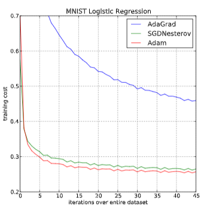
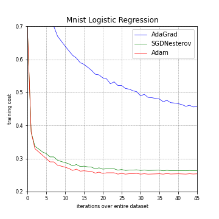
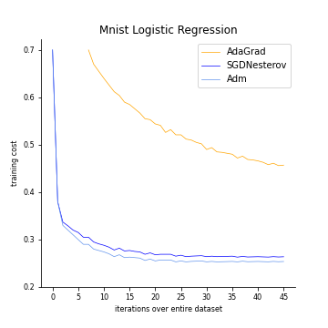

# Project 2 Report

### Group X:

- Ziyao Wang, 320180940361
- Ke Lei, 320180939861

## 1. Abstract

This report is used to record and present our group's work in project 2. First, we selected a data visualization chart from a very influential paper, and then we introduced and explained it (from the aspects of context, visual variables, etc.). 

Next, we first reproduce this chart, and then improve it according to some basic principles and principles of visualization to make it conform to the theoretical knowledge of information visualization. Finally, we summarize the work of the whole project.

## 2.Introduction

#### 2.1 Influential Chart Source

We extracted this graph from a paper on deep learning optimization methods.

	@article{kingma2015adam,
	title={Adam: A Method for Stochastic Optimization},
	author={Kingma, P. Diederik and Ba, Lei Jimmy},
	journal={international conference on learning representations},
	year={2015}

You can read this paper by visiting:

https://www.aminer.cn/pub/5550415745ce0a409eb3a739/adam-a-method-for-stochastic-optimization

#### 2.2 The original image

As we can see, the original chart we selected is like this:

#### 2.3 Why we choose it

This visualization image has a deep machine learning knowledge background, the visualization structure is clear, and the data is easy to understand.The visualization in the paper we selected has fallen into several visualization pitfalls learned in class. So it is easy for us to modify and improve.

#### 2.4 Impact in the society

The number of citations of the source paper for this visualization is 49516 and it has a very important influence in the field of deep learning. The paper indicates that the Adam algorithm, which combines two traditional algorithms, has advantages over traditional algorithms (Adagrad, SGD) in terms of training costs.

This information visualization result promotes the Adam algorithm with lower training cost and higher efficiency. Adam algorithm is considered to replace traditional SGD and Adagrad algorithms in many occasions.It also caused a lot of controversy between SGD algorithm and Adam algorithm$^{[1]}$.

## 3. Interpretation Visualization

#### 3.1 Visualization background

Adam is an algorithm for first-order gradient-based optimization of stochastic  objective  functions,  based  on  adaptive  estimates  of  lower-order  moments.  The method is straightforward to implement, is computationally efficient,has little memory requirements, is invariant to diagonal rescaling of the gradients,and is well suited for problems that are large in terms of data and/or parameters.The method is also appropriate for non-stationary objectives and problems with very noisy and/or sparse gradients.Empirical results demonstrate that Adam works well in practice and compares favorably to other stochastic optimization methods. 

Our aim is to compare different algorithm to show some of Adam’s advantages.

We want to evaluate the different algorithms by using large models and datasets,and we demonstrate Adam can efficiently solve practical deep learning problems.Otherwise, we use the same parameter initialization when comparing different optimization algorithms. 

#### 3.2 The story of visualization

#### 3.3 how to read it

#### 3.4 visual variables

#### 3.5 the analysis of the information visualization

用认知理论中的一些概念来说明可视化效果

#### 3.6 context

## 4.Replicate the information visualization

We use Matplotlib in Python to reproduce the image. The specific code is in X$^{[2]}$.

 
    <figure>
    
    
    </figure>

In the figure above, the chart on the left is origin chart and the right is our replicated chart.

## 5.Improvement and implement

#### 5.1 Proposal improvements

There are changes we have improved.
* Change the color of the line
* Remove the grid
* Remove the top and right border 

Please let me have a easy statement for these improvements. First, we change the three line color from red-green to blue-yellow legend. This is because the red-green can lead confusion to some people according to cognitive theory. In addition, too much grid will take away people's attention, which can take information overload. What's more, we turn off the top and right box to provide the minimum amount of information to make sure reader can concentrate on the graph itself.

It's need to take attention to the color we choose to improve. The blue and yellow are contrast color that can give reader a more obvious sight to the contrast of different method in graph. It also intensify the advantage of AdaGrad method in comparison.

#### 5.2 implement

The specific code is in X$^{[3]}$.

 
 
    <figure>
    
    
    </figure>

## 6.Conclusion

## References

[1] [Deep learning paper](https://www.aminer.cn/pub/5550415745ce0a409eb3a739/adam-a-method-for-stochastic-optimization)

[2] [replicaate code](replicate.ipynb)

[3] [Improment code](Improment.ipynb)

[4] [How Is Data Visualization Inflfluenced By Our Cognitive Processes?](https://medium.com/@jiajingguo/how-is-data-visualization-inflfluenced-by-our-cognitive-processes-281d8486abfe)