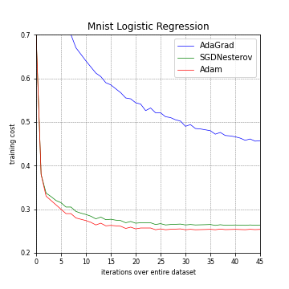
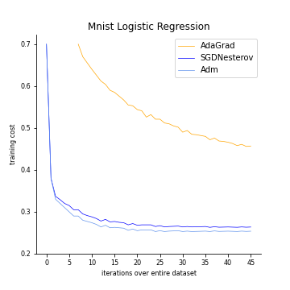

# Project 2 Report

### Group X:

- Ziyao Wang, 320180940361
- Ke Lei, 320180939861
- Tao Tao, 320180940281

## 1. Abstract

This report is used to record and present our group's work in project 2. First, we selected a data visualization chart from a very influential paper, and then we introduced and explained it (from the aspects of context, visual variables, etc.). 

Next, we first reproduce this chart, and then improve it according to some basic principles and principles of visualization to make it conform to the theoretical knowledge of information visualization. Finally, we summarize the work of the whole project.

## 2.Introduction

#### 2.1 Influential Chart Source

We extracted this graph from a paper on deep learning optimization methods.

	@article{kingma2015adam,
	title={Adam: A Method for Stochastic Optimization},
	author={Kingma, P. Diederik and Ba, Lei Jimmy},
	journal={international conference on learning representations},
	year={2015}

You can read this paper by visiting:

https://www.aminer.cn/pub/5550415745ce0a409eb3a739/adam-a-method-for-stochastic-optimization

#### 2.2 The original image

As we can see, the original chart we selected is like this:

#### 2.3 Why we choose it

This visualization image has a deep machine learning knowledge background, the visualization structure is clear, and the data is easy to understand.The visualization in the paper we selected has fallen into several visualization pitfalls learned in class. So it is easy for us to modify and improve.

#### 2.4 Impact in the society

The number of citations of the source paper for this visualization is 49516 and it has a very important influence in the field of deep learning. The paper indicates that the Adam algorithm, which combines two traditional algorithms, has advantages over traditional algorithms (Adagrad, SGD) in terms of training costs.

This information visualization result promotes the Adam algorithm with lower training cost and higher efficiency. Adam algorithm is considered to replace traditional SGD and Adagrad algorithms in many occasions.It also caused a lot of controversy between SGD algorithm and Adam algorithm$^{[1]}$.

## 3. Interpretation Visualization

#### 3.1 Visualization background

Adam is an algorithm for first-order gradient-based optimization of stochastic  objective  functions,  based  on  adaptive  estimates  of  lower-order  moments.

Our aim is to compare different algorithm to show some of Adam’s advantages.

We want to evaluate the different algorithms by using large models and datasets,and we demonstrate Adam can efficiently solve practical deep learning problems.Otherwise, we use the same parameter initialization when comparing different optimization algorithms. 

#### 3.2 The story of visualization
The main characters in the visualization is Adam,Adagrad and SGD Nesterov.
The main data of the visualization is logistic regression training negative log likelihood on MNIST images with 10,000 bag-of-words feature vectors.

The visualization graph uses three lines of different colors to clearly compare the training costs of the three algorithms under different (0-45) iteration times.Our aim is to compare different algorithm to show some of Adam’s advantages.

But this curve has flaws in cognitive theory, such as insufficient data clarity, and unfriendly red-green color blindness.There are redundant grid lines, etc.

#### 3.3 how to read it

According to the core information of the figure, the training cost difference of the three algorithms under the same number of iterations can be compared vertically. The line chart can help readers to study the reduction in training costs as the number of iterations increases.

We can understand the data about the result of logistic regression training negative log likelihood on MNIST images with 10,000 bag-of-words feature vectors. We can find some important contexts. For example, the Adam yields similar convergence as SGD with momentum and both converge faster than Adagrad.

#### 3.4 visual variables
The curve in the figure represents that changing value of training cost because of different iterations over entire dataset.Different curve colors represent different algorithm types.
X-axis represents iterations over the entire data set,y-axis represents the training cost.

#### 3.5 the analysis of the information visualization

We compare Adam to accelerated SGD with Nesterov momentum and Adagrad using mini batch size of 128. According to the figure, we found that the Adam yields similar convergence as SGD with momentum and both converge faster than Adagrad. Adagrad can efficiently deal with sparse features and gradients as one of its main theoretical results whereas SGD is low at learning rare features. Adam with1/√t decay on its step size match the performance of Adagrad. 

 In the figure, Adagrad outperforms SGD with Nesterov momentum by a large margin both with and without dropout noise.  Adam converges as fast as Adagrad.  Similar to Adagrad, Adam can take advantage of sparse features and obtain faster convergence rate than normal SGD with momentum.

#### 3.6 cognitive theory of the visualization and its context
According to the core information of the figure, the training cost difference of the three algorithms under the same number of iterations can be compared vertically. Readers can also take advantage of the line chart to study the reduction in training costs as the number of iterations increases.

The curve has flaws in cognitive theory , such as insufficient data clarity, and unfriendly red-green color blindness.There are redundant grid lines, etc. So we need to improve the curve.

## 4.Replicate the information visualization

We use Matplotlib in Python to reproduce the image. The specific code is in X$^{[2]}$.

 
    <figure>
    
    
    </figure>

In the figure above, the chart on the left is origin chart and the right is our replicated chart.

## 5.Improvement and implement

#### 5.1 Proposal improvements

There are changes we have improved.
* Change the color of the line
* Remove the grid
* Remove the top and right border 

Please let me have a easy statement for these improvements. First, we change the three line color from red-green to blue-yellow legend. This is because the red-green can lead confusion to some people according to cognitive theory. In addition, too much grid will take away people's attention, which can take information overload. What's more, we turn off the top and right box to provide the minimum amount of information to make sure reader can concentrate on the graph itself.

It's need to take attention to the color we choose to improve. The blue and yellow are contrast color that can give reader a more obvious sight to the contrast of different method in graph. It also intensify the advantage of AdaGrad method in comparison.

#### 5.2 implement

The specific code is in X$^{[3]}$.

 
 
    <figure>
    
    
    </figure>

## 6.Conclusion

We have gained a lot from this project. We not only read a lot of papers on deep learning, but also practice the realization and improvement of visualization.

We are surprised to find that even very important academic papers violate some principles of information visualization.If these important papers follow the relevant visualization principles, it will be easier for people to understand.

This work will remind us to follow the principles of visualization when writing academic papers in the future.

## References

[1] [Deep learning paper](https://www.aminer.cn/pub/5550415745ce0a409eb3a739/adam-a-method-for-stochastic-optimization)

[2] [replicaate code](replicate.ipynb)

[3] [Improment code](Improment.ipynb)

[4] [How Is Data Visualization Inflfluenced By Our Cognitive Processes?](https://medium.com/@jiajingguo/how-is-data-visualization-inflfluenced-by-our-cognitive-processes-281d8486abfe)